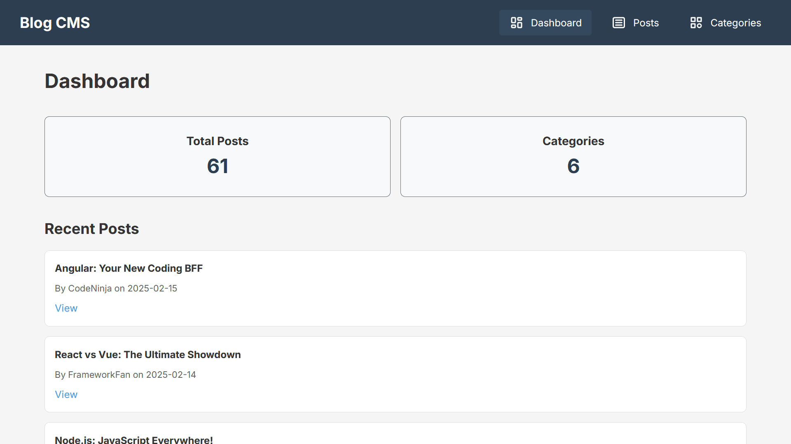
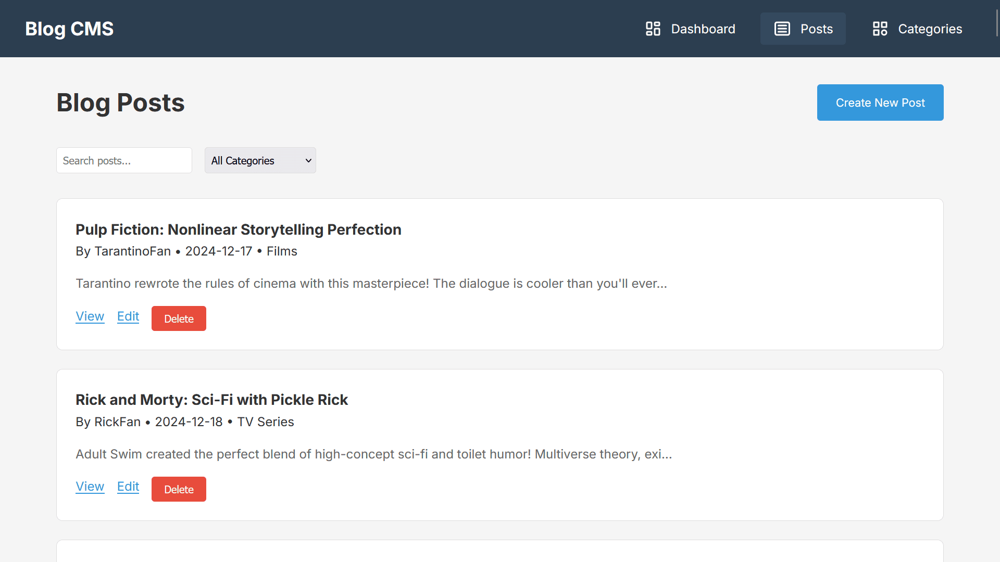
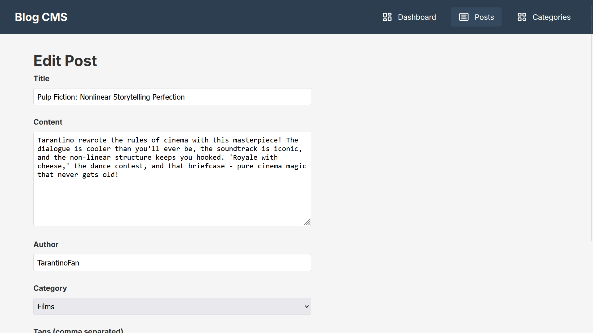
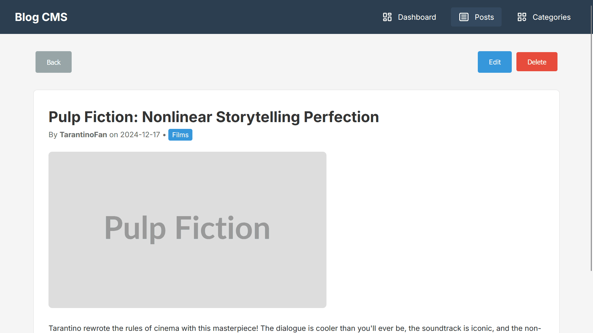
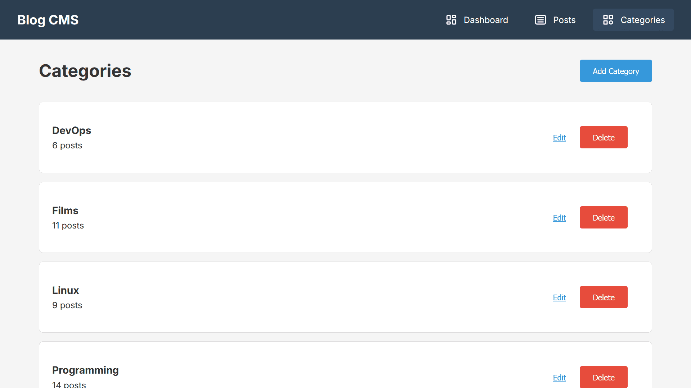

<div align="center">

# 📝 Angular Blog CMS

### A modern, feature-rich Blog Content Management System built with Angular 20


### [🌐 View Live Demo](https://blog-cms-angular.vercel.app) | [📸 Screenshots](https://github.com/SharadJ19/blog-cms?tab=readme-ov-file#-screenshots)

</div>

## 🎯 About The Project

Angular Blog CMS is a lightweight, intuitive content management system that demonstrates modern Angular development practices. Perfect for learning Angular fundamentals or as a starter template for your blog platform.

### ✨ Key Highlights

- 🎨 **Clean Architecture** - Well-organized component structure
- 🚀 **Modern Stack** - Built with Angular 20 and TypeScript 5.4
- 📱 **Responsive Design** - Works seamlessly across all devices
- ⚡ **Fast Performance** - Optimized for speed and efficiency
- 🔧 **Easy Setup** - Get started in minutes

## 🚀 Quick Start

Get up and running in just a few steps:

### Installation

```bash
git clone https://github.com/sharadj19/blog-cms.git
cd blog-cms
npm install
```

### Running the Application

You'll need to run both the backend API and frontend application:

```bash
# Terminal 1 - Start the JSON Server (Backend)
npm run db-json

# Terminal 2 - Start Angular Development Server (Frontend)
npm start
```

🎉 **That's it!** Your application is now running:
- **Frontend**: http://localhost:4200
- **Backend API**: http://localhost:3001

### Mobile Testing

To test on mobile devices on the same network(hotspot):

```bash
npm run start:mobile
```

## ✨ Features

<table>
<tr>
<td width="50%">

### 📊 Dashboard
- Real-time statistics
- Quick overview of all posts
- Category breakdown
- Recent activity feed

</td>
<td width="50%">

### 📝 Post Management
- Create new blog posts
- Edit existing content
- Delete posts
- Rich text formatting

</td>
</tr>
<tr>
<td width="50%">

### 🏷️ Categories
- Organize posts by category
- Create custom categories
- Category-based filtering
- Tag management

</td>
<td width="50%">

### 🔍 Search & Filter
- Full-text search
- Filter by category
- Sort by date/title
- Advanced filtering options

</td>
</tr>
</table>

## 🛠️ Tech Stack

| Technology | Purpose |
|------------|---------|
| **Angular 20** | Frontend framework |
| **TypeScript 5.4** | Programming language |
| **json-server** | Mock REST API |
| **Angular Router** | Navigation & routing |
| **RxJS** | Reactive programming |
| **Vercel** | Deployment platform |

## 📁 Project Structure

```
blog-cms/
|
├── json-server-db/
│   └── db.json                     # Mock API data
│
├── public/
│   └── favicon.ico
│
├── screenshots/                    # App screenshots for README
│   ├── categories.png
│   ├── dashboard.png
│   ├── post-detail.png
│   ├── post-editor.png
│   └── posts-list.png
│
├── src/
│   ├── app/
│   │   ├── models/                 # Data models
│   │   │   ├── category-model.ts
│   │   │   └── post-model.ts
│   │   │
│   │   ├── pages/                  # App pages / routes
│   │   │   ├── categories/
│   │   │   │   ├── categories.html
│   │   │   │   ├── categories.ts
│   │   │   │   └── categories.css
│   │   │   │
│   │   │   ├── dashboard/
│   │   │   │   ├── dashboard.html
│   │   │   │   ├── dashboard.ts
│   │   │   │   └── dashboard.css
│   │   │   │
│   │   │   ├── post-detail/
│   │   │   │   ├── post-detail.html
│   │   │   │   ├── post-detail.ts
│   │   │   │   └── post-detail.css
│   │   │   │
│   │   │   ├── post-form/
│   │   │   │   ├── post-form.html
│   │   │   │   ├── post-form.ts
│   │   │   │   └── post-form.css
│   │   │   │
│   │   │   └── posts/
│   │   │       ├── posts.html
│   │   │       ├── posts.ts
│   │   │       └── posts.css
│   │   │
│   │   ├── services/
│   │   │   └── api-service.ts      # REST API wrapper
│   │   │
│   │   ├── app.config.ts
│   │   ├── app.html
│   │   ├── app.ts
│   │   └── app.routes.ts
│   │
│   ├── assets/
│   │   └── icons/                  # UI icons
│   │       ├── categories.svg
│   │       ├── dashboard.svg
│   │       └── posts.svg
│   │
│   ├── environments/               # Env configs
│   │   ├── environment.ts
│   │   └── environment.development.ts
│   │
│   ├── index.html
│   ├── main.ts
│   └── styles.css
│
├── package.json
└── angular.json                    # Angular project config
```

## 🔧 Development

### Available Scripts

| Command | Description |
|---------|-------------|
| `npm start` | Start Angular development server |
| `npm run db-json` | Start JSON Server backend |
| `npm run build` | Build for production |
| `npm run start:mobile` | Start with network access for mobile testing |
| `npm test` | Run unit tests |

### Configuration

Environment configurations can be modified in:
- `src/environments/environment.development.ts` (development)
- `src/environments/environment.ts` (production)

## 📚 What I Learned

This project helped me master:

✅ **Angular Fundamentals**
- Component architecture and lifecycle hooks
- Dependency injection and services
- Template and reactive forms
- Data binding and event handling

✅ **Routing & Navigation**
- Angular Router configuration
- Route guards and lazy loading
- Navigation strategies

✅ **HTTP & APIs**
- HttpClient for API calls
- Observable patterns with RxJS
- Error handling and interceptors

✅ **TypeScript**
- Strong typing and interfaces
- Generics and advanced types
- Best practices and patterns

✅ **Development Workflow**
- Version control with Git
- Code organization and structure
- Debugging techniques
- Deployment strategies

## 📸 Screenshots

<table>
<tr>
<td width="50%">
<h3 align="center">📊 Dashboard Overview</h3>

<p align="center"><i>Real-time statistics and insights at a glance</i></p>
</td>
<td width="50%">
<h3 align="center">📝 Posts Management</h3>

<p align="center"><i>Browse, search, and manage all your blog posts</i></p>
</td>
</tr>

<tr>
<td width="50%">
<h3 align="center">✍️ Post Editor</h3>

<p align="center"><i>Intuitive interface for creating and editing content</i></p>
</td>
<td width="50%">
<h3 align="center">👁️ Post Details</h3>

<p align="center"><i>Detailed view of individual blog posts</i></p>
</td>
</tr>

<tr>
<td width="50%">
<h3 align="center">🏷️ Category Management</h3>

<p align="center"><i>Organize your content with custom categories</i></p>
</td>
<td width="50%">
</td>
</tr>
</table>

## 📝 License

Distributed under the **GNU General Public License v3.0**. See `LICENSE` for more information.

## 👨‍💻 Author

<div align="center">

### **Sharad Chandel**

Full Stack Developer | Open Source Enthusiast

[](https://github.com/sharadj19)
[](https://sharad.is-a.dev)

</div>

## 💬 Feedback

If you have any feedback, please reach out by creating an [issue](https://github.com/sharadj19/blog-cms/issues) or connecting with me through my portfolio!

<div align="center">

### ⭐ Don't forget to star this repo if you found it helpful!

Made with ❤️ by [Sharad Chandel](https://github.com/sharadj19)

</div>
